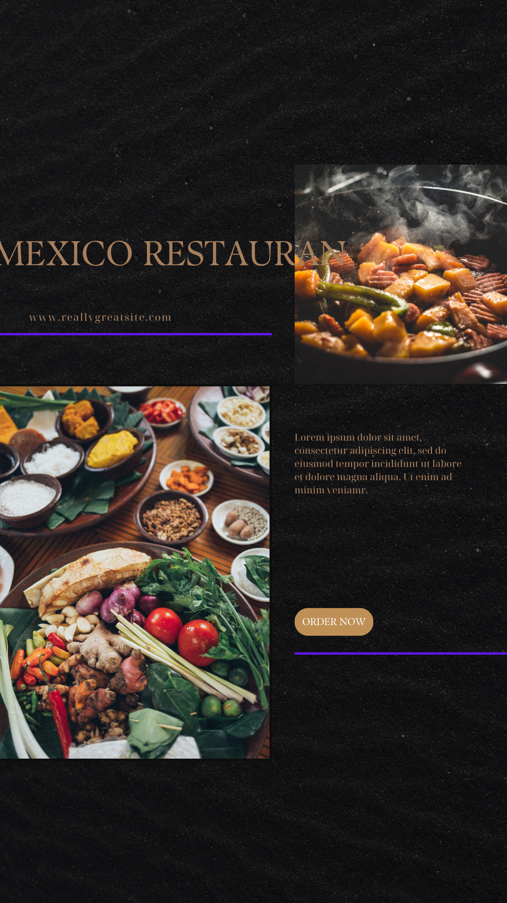
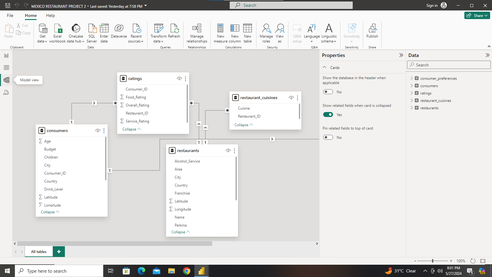
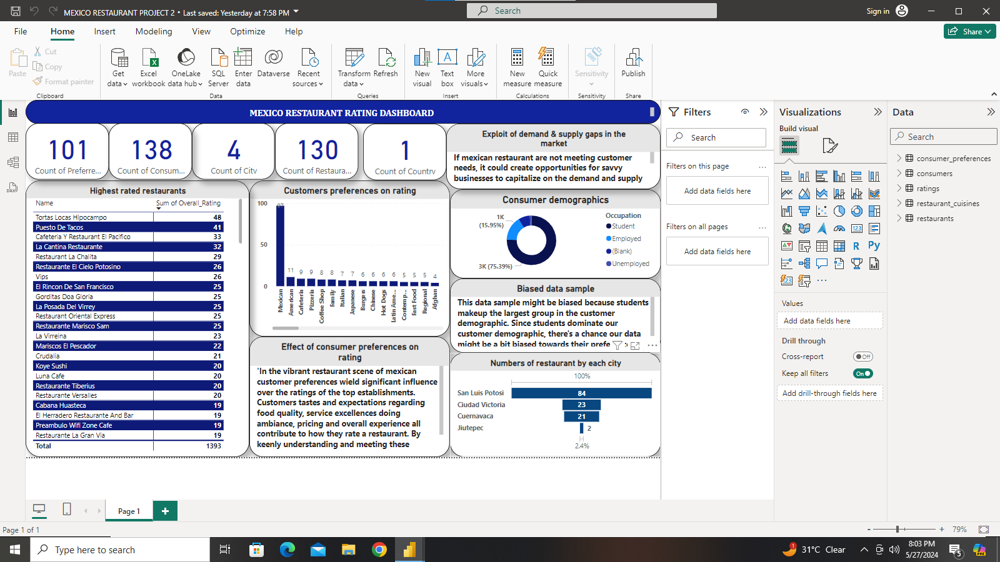
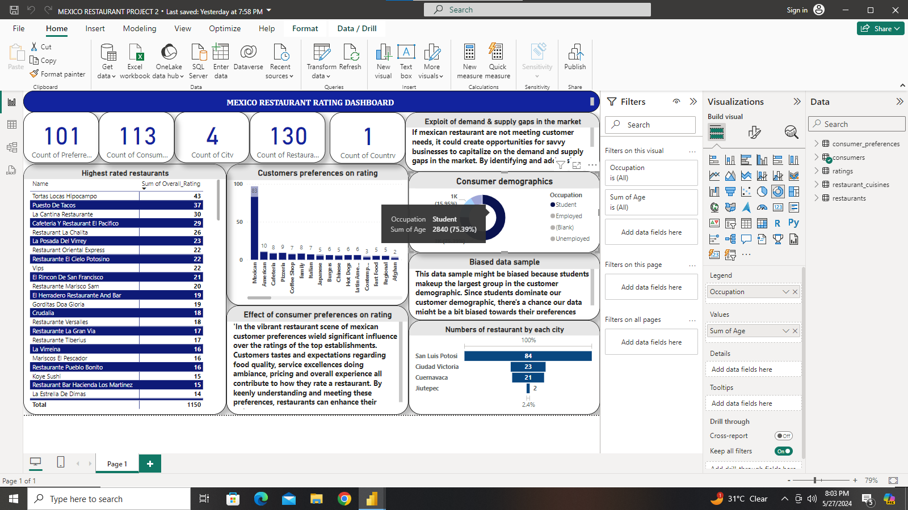

# Restaurant-Ratting

## Introduction
This is a powerbi project on **MEXICO RESTAURANTS** Mexico nestle in the heart of burstling streets, the restaurants exudes a captivating blend of traditional charm and modern flair. Join me as we explore the delectable offerings and exceptional clining ambiance that set te restaurant apart in the bustling food scene of mexico.

## Problem statement
1. What can learn from the highest rated restaurant? Do consumer preferences have an effect on ratings?
2. What are consumers demographics? Does this indicate a bias in the data sample?
3. Are there any demand$supply gaps that you can exploit in the market?
4. If you were to invest in a restaurant, which characteristics would you be looking for?

   ## Skills
   - Bookingmarking
   - Dax
   - Quick measure
   - Page
   - Navigation
   - Modelling
   - Filters
   - Tooltips
   - Button
  
     ## Modelling
     
     

     ## Visualization

     The dataset comprises of two pages

     
     

     ## Conclusion/ Recomendation

     
     People will always want to invest in restaurants that will yield a lot of profits and consumer will always go for restaurants that will satisfy their needs/wants.
